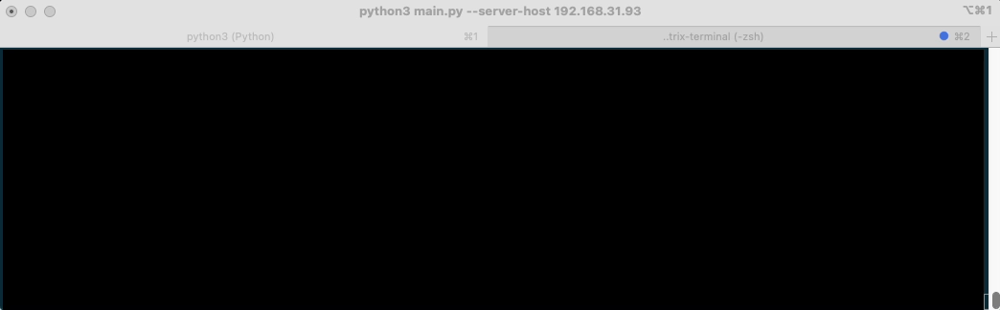

# awtrix-terminal

运行在终端的 awtrix 模拟客户端

## 什么是 awtrix

> https://awtrixdocs.blueforcer.de/#/en-en/README

## awtrix 控制器源码

> https://github.com/awtrix/AWTRIX2.0-Controller/blob/master/src/AWTRIXController.cpp

## 运行效果



## 运行教程

```sh
pip3 install requirements.txt
```

```sh
usage: main.py [-h] [--server-host SERVER_HOST] [--server-port SERVER_PORT] [--pixel-size PIXEL_SIZE]

Awtrix终端模拟器

optional arguments:
  -h, --help            show this help message and exit
  --server-host SERVER_HOST
                        awtrix服务器域名
  --server-port SERVER_PORT
                        awtrix服务器端口
  --pixel-size PIXEL_SIZE
                        awtrix像素尺寸
```
